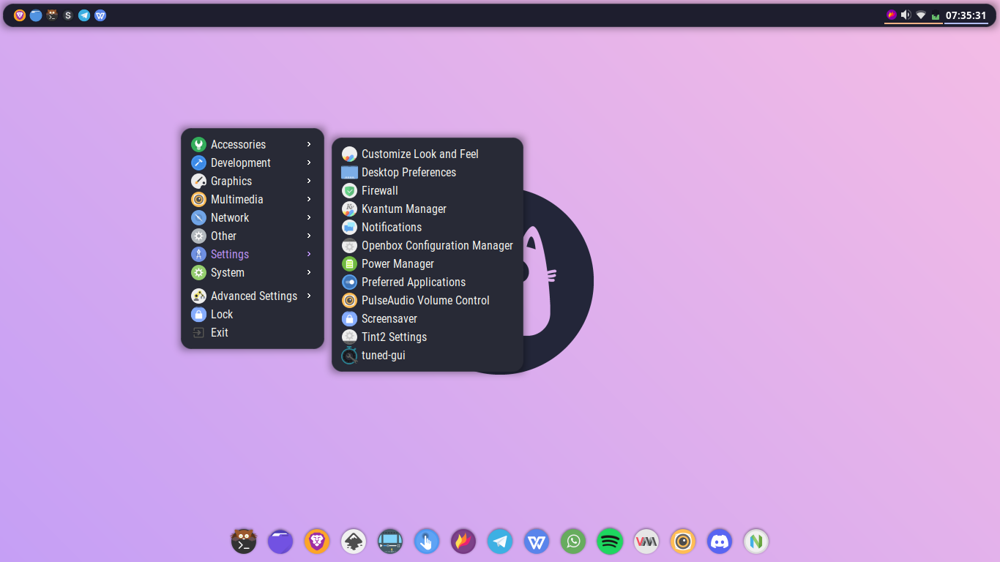
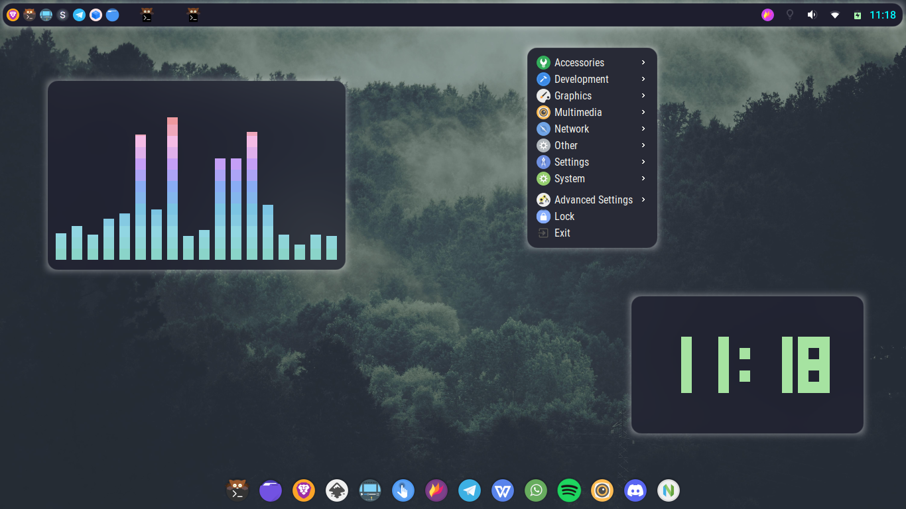
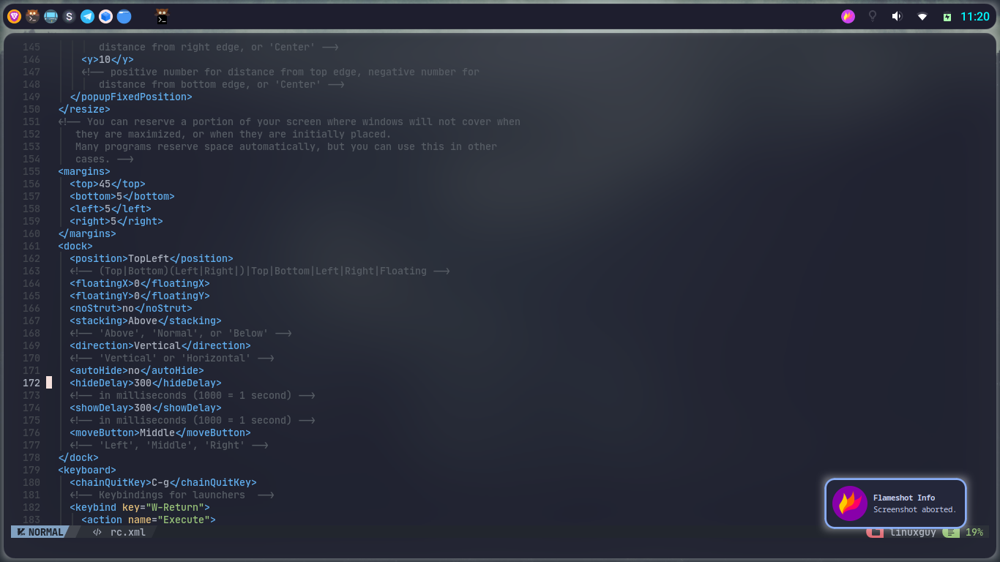
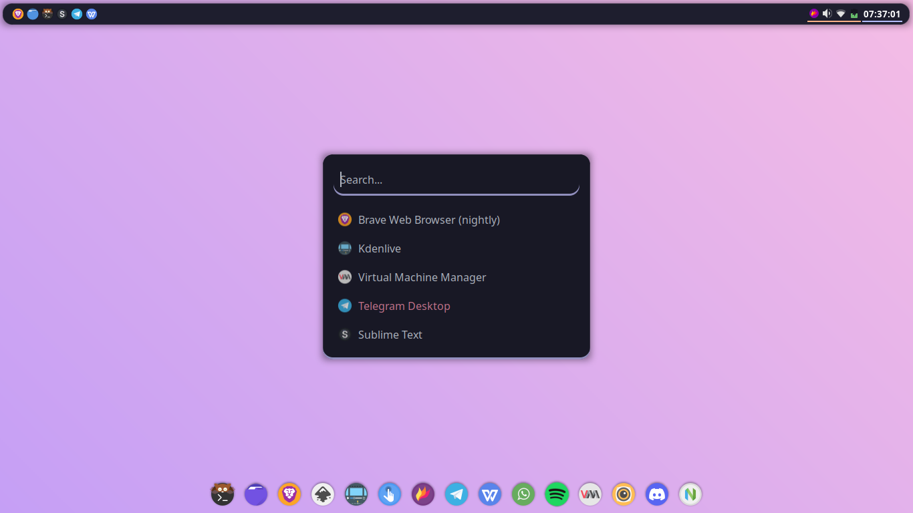
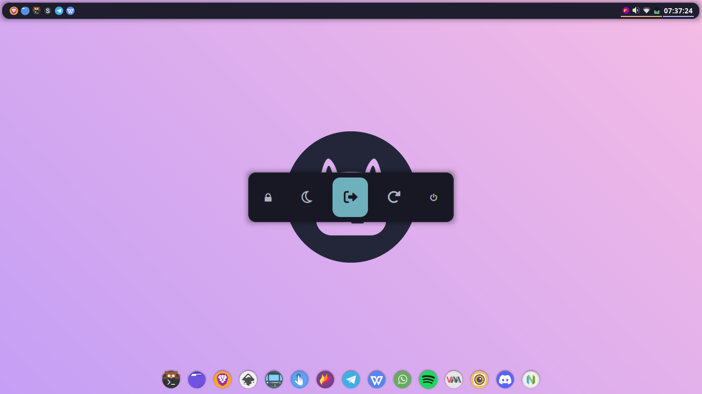
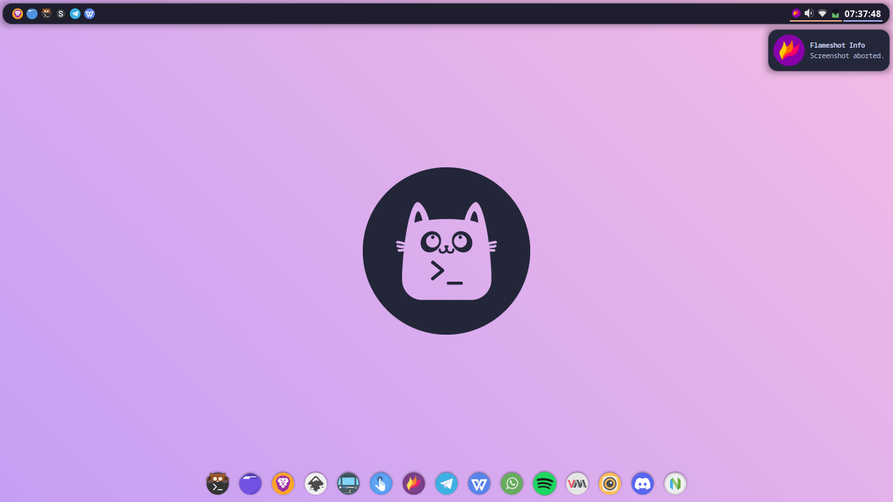

<p align="center"> ~ OpenBox Minimal Configurations ~ </p>

<p align="center"> ~[ Make sure u have installed this ]~ </p>

```

* WM : Openbox 
* Terminal : kitty 
* Application launcher : Rofi 
* Bar : Tint2 
* Compositor : Picom 
* Notification : dunst 
* Screenshot : flameshot 
* Network Manager : nm-applet
* Power Manager : network-manager-applet 
* Dock : Plank 
* Volume Control : pavucontrol 
* Volume Tray : volumeicon 
* Policy kit Authentication : polkit-gnome 
* Wallpaper Utility : feh 
* File Manager : thunar 
* Browser : Brave -> As my choice you can use your own choice 
* Desktop root menu : obmenu-generator 

```

<p align="center"> ~[ Touchpad gestures ]~ </p>

```
* libinput-gestures 
* gestures 
[ Grab them from aur with paru or yay | or build it from source ]
```

<p align="center"> ~[ Themes Configurations ]~ </p>

```

* obconf -> first install this to set openbox themes and configuring openbox from gui app 
* https://github.com/dracula/openbox -> use dracula without border 
* paru -S tela-circle-icon-theme-git -> Icon theme 
* https://github.com/catppuccin/gtk -> Use this gtk theme as i have rice everything based on catppuccin mocha colorplate

```

<p align="center"> ~[ Fonts ]~ </p>

```

* JetBrains Mono Nerd Fonts -> [ Must Install ]
* Hack Nerd Fonts -> Application launcher font [ must install ]
* Cantrell 
* Roboto 
* https://www.nerdfonts.com/font-downloads -> download nerdfonts from here 
* fc-cache -v -> relaod font cache 

```

<p align="center"> ~[ Installation ]~ </p>

```

* git clone https://github.com/TheLinuxGuy001/openbox-minimal.git && cd openbox-* && ls -l 
* cp -rv openbox ~/.config/ -> if openbox directory already exists then remove it 
* openbox --reconfigure && openbox --restart -> restarts and reconfigure openbox Wms 
* obmenu-generator -p -i -> dynamic menu with icons 

```

<p align="center"> ~[ Shadow Color Change ]~ </p> 

Just search for following line on ~/.config/openbox/configurations/picom/picom.conf & uncomment them | you can also change colors accordingly using RGB values 

```

* shadow-red = 180 
* shadow-green = 190
* shadow-blue = 254

```

---
<p align="center"> ~[ ScreenShots ]~ </p>


<p align="center"> ~[ Simple & Elegant Look ]~ </p>




<p align="center"> ~[ Pink Shadow ]~ </p>




<p align="center"> ~[ App Launcher ]~ </p>



<p align="center"> ~[ PowerMenu ]~ </p>



<p align="center"> ~[ Notification ]~ </p>




---


[Note : All the dependencies and Fonts needs to be properly installed otherwise may not work properly ]
